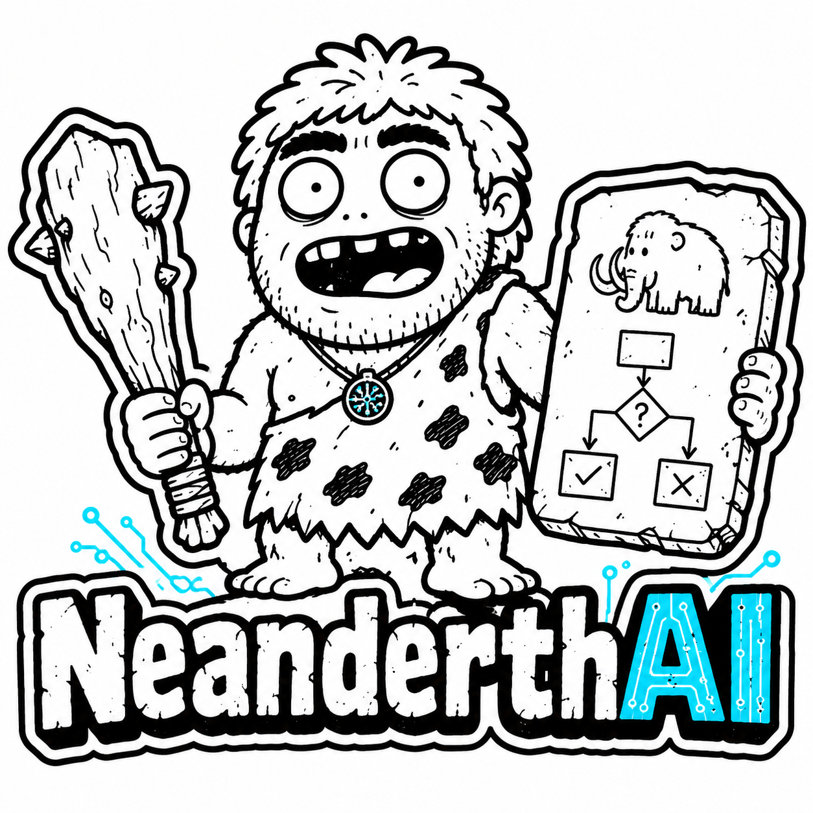

# NeanderthAI

> Primitive context. Modern reasoning.

<p align="center">
  
</p>

NeanderthAI is one Agent Skill combining Ponytail's minimal implementation discipline with Caveman's terse, exact communication. It scales investigation to risk, searches before reading, validates proportionally, and stops when the requested result is proven.

## Supported agents

The canonical bundle uses portable `SKILL.md` frontmatter. Current official locations are:

| Agent | Project install | Personal install |
|---|---|---|
| OpenAI Codex | `.agents/skills/neanderthai` | `~/.agents/skills/neanderthai` |
| Claude Code | `.claude/skills/neanderthai` | `~/.claude/skills/neanderthai` |
| GitHub Copilot | `.github/skills/neanderthai` | `~/.copilot/skills/neanderthai` |

Sources: [OpenAI Codex skills](https://developers.openai.com/codex/skills), [Claude Code skills](https://code.claude.com/docs/en/slash-commands), and [GitHub Copilot skills](https://docs.github.com/en/copilot/how-tos/copilot-on-github/customize-copilot/customize-cloud-agent/add-skills).

## Install without Python

NeanderthAI has no runtime dependencies. Download the repository ZIP and copy the matching folder from `dist/` to the project or personal location in the table above:

- Codex: `dist/codex/.agents/skills/neanderthai`
- Claude Code: `dist/claude/.claude/skills/neanderthai`
- GitHub Copilot: `dist/copilot/.github/skills/neanderthai`

This works with a file manager on restricted corporate computers; no script, installer, package manager, or executable permission is required.

## Optional maintainer helper

Python 3.9+ is used only to update, validate, or install from the canonical source. It has no third-party dependencies.

```sh
python3 scripts/neanderthai.py all
python3 scripts/neanderthai.py install codex --scope project
python3 scripts/neanderthai.py install claude --scope user
python3 scripts/neanderthai.py install copilot --scope project --target /path/to/repo
```

Installation refuses to overwrite an existing skill. Review or remove the existing destination first.

Invoke explicitly as `$neanderthai` in Codex or `/neanderthai` in Claude Code and Copilot CLI. Matching coding, YAGNI, minimal-solution, brief-output, Ponytail, or Caveman requests may activate it implicitly.

Build strictness and writing compactness are separate:

```text
neanderthai build lite|full|ultra
neanderthai feedback 0|1|2|3
neanderthal 3                    # feedback shorthand
```

Feedback `0` uses clear full sentences, `1` is compact, `2` is classic caveman (default), and `3` is maximum safe “grunt” compression. Feedback level never reduces reasoning, validation, warnings, or implementation quality.

## Architecture

```text
skill-src/neanderthai/     canonical runtime bundle
dist/{codex,claude,copilot}/ generated install-ready trees
sources/                   inspected parent snapshots; never shipped
docs/                      merge analysis and generated token audit
evals/                     behavioral specifications
scripts/neanderthai.py     build, install, validation, audit, eval checks
```

Edit only `skill-src/neanderthai`, then run `python3 scripts/neanderthai.py all`. Validation hashes every generated package against the canonical source, checks frontmatter and links, rejects user-specific absolute paths, and verifies eval coverage.

The core is a compact router. Non-default communication modes and failure recovery load only when relevant; measured costs are in [the token audit](docs/token-audit.md).

## Runtime smoke tests

After installing, start a fresh session (or reload skills) and try:

```text
Use NeanderthAI to add a date picker with the smallest verified change.
Use NeanderthAI feedback 0 and explain the tradeoff clearly.
Use NeanderthAI wenyan-full to explain why this component re-renders.
```

Static packaging tests do not claim model-level behavioral equivalence. The cases in `evals/cases.json` are portable prompts and scoring criteria for host-specific evaluation harnesses.
